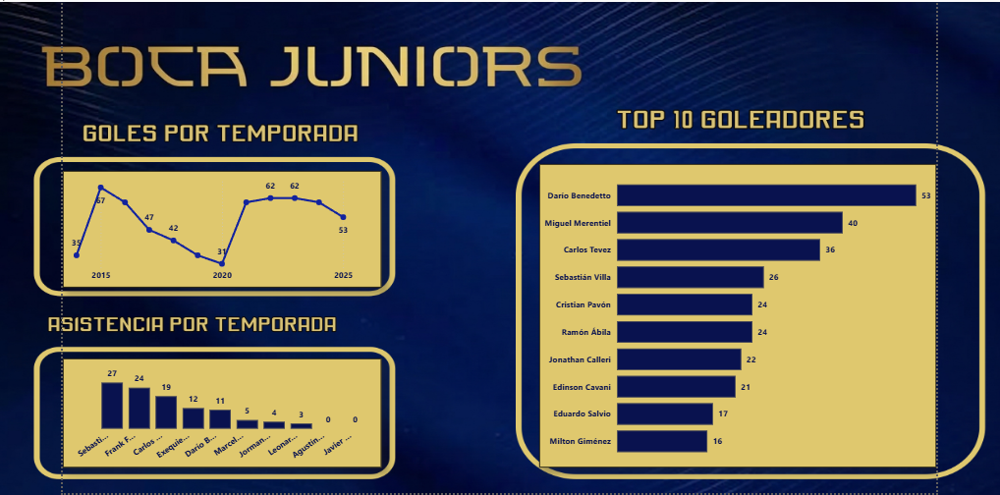
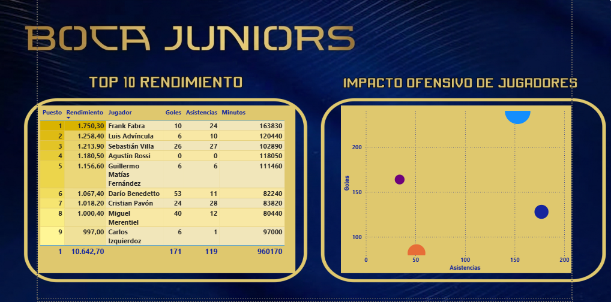
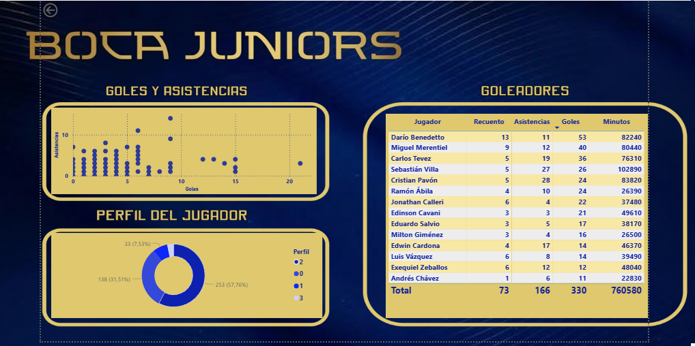

# Boca Juniors Player Analytics

Análisis de rendimiento de jugadores de Boca Juniors (2014–2025) utilizando Python, machine learning y visualización en Power BI.

## Introducción

Este proyecto analiza el rendimiento de los jugadores de Boca Juniors durante la última década utilizando técnicas de análisis de datos y machine learning.

La idea nace de unir dos aspectos importantes de mi recorrido profesional y personal: por un lado, mi pasado como periodista deportiva y mi pasión por el fútbol, especialmente por Boca Juniors; por otro, mi presente formándome y trabajando en análisis de datos.

El objetivo fue convertir datos futbolísticos en información analizable, aplicar técnicas de ciencia de datos y responder preguntas concretas, como por ejemplo:

**¿Quién fue el jugador más influyente de Boca Juniors en la última década según los datos?**

Este proyecto representa un punto de encuentro entre mi interés por los números, el análisis y el deporte.

---

# Origen de los datos

El dataset utilizado proviene de Kaggle, una de las plataformas más conocidas dentro de la comunidad de ciencia de datos.

Fuente: Kaggle

Los datos contienen estadísticas detalladas de Boca Juniors por temporada, incluyendo:

- estadísticas de jugadores  
- minutos jugados  
- tiros  
- pases  
- estadísticas defensivas  
- datos de partidos  

La base original fue procesada y transformada para generar datasets analíticos listos para exploración y modelado.

---

# Stack tecnológico

Este proyecto fue desarrollado utilizando el siguiente stack:

### Lenguajes y herramientas

- Python  
- Pandas  
- Scikit-learn  

### Entorno de desarrollo

- Visual Studio Code  

### Análisis y visualización

- Power BI  

### Control de versiones

- Git  
- GitHub  

---

# Estructura del proyecto

```
Boca-Juniors-Analytics

data
 ├ raw
 └ processed

scripts
 ├ load_data.py
 ├ clean_data.py
 ├ build_master_dataset.py
 ├ player_ranking.py
 ├ player_clustering.py
 └ goal_prediction.py

powerbi
 └ boca_analytics_dashboard.pbix

img
 ├ dashboard_overview.png
 ├ player_ranking.png
 └ player_clusters.png
```

---

# Pipeline del proyecto

El proyecto se desarrolló siguiendo un pipeline completo de análisis de datos.

## 1. Carga de datos

Script:

```
load_data.py
```

En esta etapa se cargaron todos los archivos del dataset original provenientes de Kaggle.

Los datasets correspondían a diferentes tipos de estadísticas:

- estadísticas generales de jugadores  
- tiros  
- pases  
- tiempo de juego  
- estadísticas defensivas  
- logs de partidos  

Luego se consolidaron por tipo de estadística para facilitar su procesamiento posterior.

Resultado:

Datasets combinados por categoría.

---

## 2. Limpieza de datos

Script:

```
clean_data.py
```

Se aplicaron procesos de limpieza como:

- normalización de nombres de columnas  
- conversión de variables a formato numérico  
- eliminación de valores inconsistentes  
- tratamiento de valores nulos  

El objetivo fue generar datasets consistentes y preparados para análisis.

Resultado:

Datasets limpios almacenados en:

```
data/processed
```

---

## 3. Construcción del dataset maestro

Script:

```
build_master_dataset.py
```

En esta etapa se integraron diferentes estadísticas de jugadores en un único dataset analítico.

Se unieron datasets de:

- estadísticas generales  
- tiros  
- pases  
- minutos jugados  

Las claves utilizadas para los merges fueron:

- jugador  
- temporada  

Resultado:

```
master_player_stats.csv
```

Este dataset constituye la base principal del análisis.

---

## 4. Ranking de jugadores

Script:

```
player_ranking.py
```

Se construyó una métrica simple de rendimiento basada en:

- goles  
- asistencias  
- minutos jugados  

Se generó un ranking de jugadores de Boca Juniors entre 2014 y 2025.

Principales resultados del ranking:

1. Darío Benedetto  
2. Sebastián Villa  
3. Frank Fabra  
4. Carlos Tevez  
5. Miguel Merentiel  
6. Cristian Pavón  
7. Luis Advíncula  
8. Guillermo Fernández  
9. Edwin Cardona  
10. Ramón Ábila  

Estos resultados reflejan jugadores que tuvieron un alto impacto ofensivo o una fuerte continuidad en el equipo durante el período analizado.

---

## 5. Clustering de jugadores

Script:

```
player_clustering.py
```

Se aplicó el algoritmo K-Means utilizando la librería Scikit-learn para identificar perfiles de jugadores según sus estadísticas.

Variables utilizadas:

- goles  
- asistencias  
- minutos jugados  

El modelo agrupó jugadores en distintos clusters, representando diferentes perfiles dentro del equipo.

Ejemplos de perfiles identificados:

- goleadores  
- generadores de juego  
- jugadores defensivos  
- jugadores mixtos  

Resultado:

```
player_clusters.csv
```

---

## 6. Modelo de predicción de goles

Script:

```
goal_prediction.py
```

Se entrenó un modelo de machine learning utilizando Random Forest para estimar la cantidad de goles de un jugador en función de sus estadísticas.

Variables utilizadas:

- asistencias  
- minutos jugados  

El modelo fue evaluado mediante error medio absoluto para medir su precisión.

Este ejercicio demuestra cómo se pueden aplicar técnicas de machine learning a datos deportivos para generar modelos predictivos.

---

# Conclusiones del análisis

El análisis permitió observar algunos patrones interesantes en los datos.

Primero, varios de los jugadores mejor rankeados coinciden con futbolistas que tuvieron un impacto significativo en Boca Juniors durante la última década.

También se observa que los jugadores con mayor continuidad en minutos tienden a acumular mayor influencia estadística dentro del equipo.

El clustering permitió identificar perfiles claros dentro del plantel, diferenciando entre:

- jugadores con rol ofensivo  
- jugadores más orientados a la generación de juego  
- futbolistas con mayor regularidad de minutos  

Finalmente, el modelo de predicción muestra cómo es posible utilizar estadísticas básicas para estimar producción ofensiva, aunque con limitaciones propias de datasets deportivos.

---

# Visualización en Power BI

El proyecto incluye un dashboard interactivo desarrollado en Power BI para explorar visualmente los resultados del análisis.

El archivo del dashboard puede descargarse desde:

```
powerbi/boca_analytics_dashboard.pbix
```

Este dashboard permite analizar de forma interactiva las estadísticas de los jugadores y explorar diferentes métricas de rendimiento.

Visualizaciones incluidas:

- ranking de jugadores según performance score  
- comparación de estadísticas individuales  
- distribución de jugadores según clustering  
- evolución de métricas ofensivas  
- relación entre minutos jugados, asistencias y goles  

Los datasets utilizados para construir el dashboard son:

```
data/processed/master_player_stats.csv
data/processed/player_clusters.csv
data/processed/team_season_summary.csv
```

---

# Dashboard

A continuación se muestran algunas vistas del dashboard desarrollado en Power BI.

## Vista general



## Ranking de jugadores



## Rendimiento de jugadores



---

# Motivación personal

Este proyecto nace de la unión entre dos etapas de mi recorrido profesional.

Durante varios años trabajé como periodista deportiva, una experiencia que me permitió desarrollar una mirada analítica sobre el fútbol desde el relato y la observación del juego.

Hoy mi camino profesional está orientado al análisis de datos. Este proyecto representa una forma de conectar ese presente con mi experiencia anterior, aplicando herramientas de análisis y machine learning a un ámbito que conozco y sigo desde hace mucho tiempo.

Elegí trabajar con datos de Boca Juniors porque es un club que sigo muy de cerca desde hace años, no solo como hincha sino también como socia.

Analizar estadísticas del equipo desde una perspectiva de datos fue una forma natural de unir mi interés por el análisis cuantitativo con una de mis pasiones más importantes: el fútbol.
